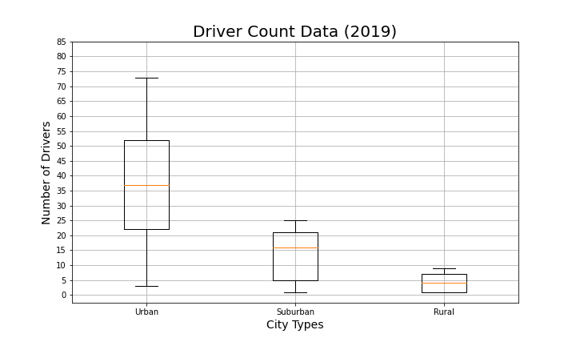

# PyBer_Analysis
Jupyter Notebook &amp; Matplotlib

## Overview
In this project, we will performg an exploratory analysis based on the rideshare data from PyBer. We will create visualizations of the rideshare data to help determine the low-services area. 

## Results

From the PyBer Summary DataFrame, we creates three pie hart that compare the PyBer's ridesharing in three types of cities: rural, suburban,a dn urban cities. The three pie charts demonstrate the similar pattern that the highest sharing of PyBer is in the urban cities. More than 68% of the rides occurs in the urban area, while only about 5.3% of the rides are in rural area. Also, there are much more drivers in the urban cities compare to rual and suburban cities.

\
figure 1: percentage of total fares by city types.

\
figure 2: percentage comparison of total rides by city types.

\
figure 3: percentage comparison of total drivers by city types.

The PyBer ride-sharing scatter plot demonstrates that urban cities has hiher number of rides and lower average fare. Similar partterns show in the box-and-whisker plot. In conlusion, the urban cities has higher demand for rides. And because of there are higher number of drivers, the ride fares is lower compare to other city type. There are less riders and drivers in the rural cities, so that the fare will be higher compare to urban and suburban cities.

\
figure 4: scatter plot showing the PyBer ride-sharing data in 2019, the size of the point represent the number of drivers.

\
figure 5: Box-and-whisker plot for ride count data among all city types.

\
figure 6: Box-and-whisker plot for fares data among all city types.

\
figure 7: Box-and-whisker plot for drivers data among all city types.

The PyBer fares muti-line chart further supports our observation stated above. The yellow line showing the urban cities has a total fares around $1600 to $2600 from January to May 2019. The Blue line represent the rural cities which has a total fares around $400-$500 during the five month. Also, there is a peak in total fares occurs among all city types in the late Feburary 2019.

figure 8: line chart shoing the total fares 

figure 9: pyber summary dataframe.

## Summary
* There are larger ride-sharing in the urban cities, more drivers should be assigned in the urban cities.
* The average fare is much higher in the rural cities, this might encourage urban driver decided to drive in the rural cities. Also decrease the potential riders from using PyBer due to the higher cost in the rural area.
* Since the number of drivers is higher in the urban cities, this might discourage potential riders from using PyBer due to lack of drivers in the rural cities.
* Suburban cities have more potential drivers and riders because it is closer to the urban area. Assigning more drivers might increase the potential riders in suburban cities.
